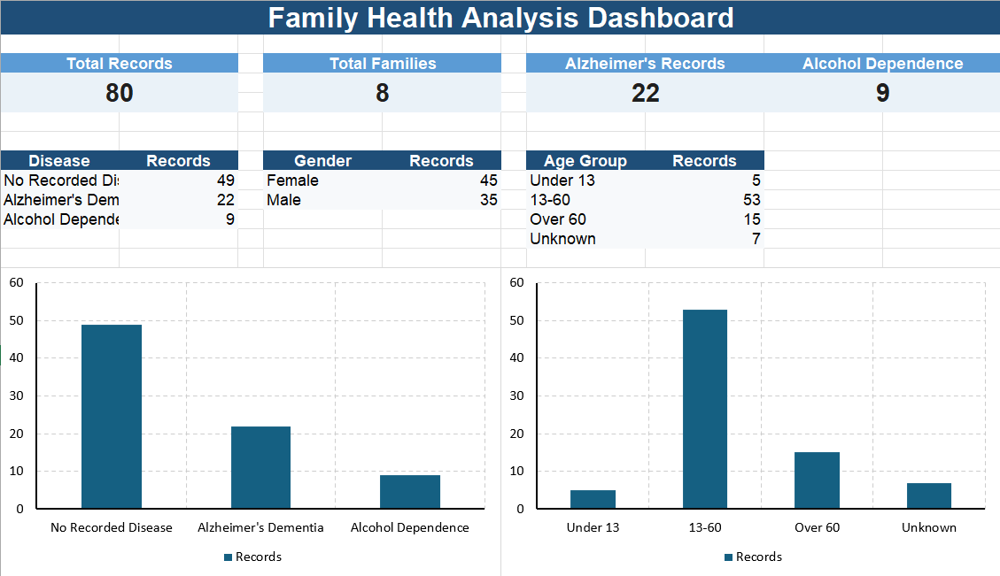

# Excel Family Health Analysis Dashboard

An Excel portfolio project demonstrating **structured data management, formula-based analysis, KPI reporting, and dashboard visualization** using synthetic family-health data.

> **Portfolio note:** All records in this project are synthetic and were created solely for demonstration and learning purposes. No real patient, participant, or personally identifiable information is included.

---

## Dashboard Preview



---

## Project Overview

This project demonstrates how Excel can be used to organize record-level information, apply consistent classifications, calculate summary metrics, and present the results in a concise dashboard for management review.

The workbook contains **80 synthetic records across 8 synthetic families** and summarizes the data by disease category, gender, age group, and family.

### Key KPIs

| KPI | Result |
|---|---:|
| Total Records | 80 |
| Total Families | 8 |
| Alzheimer's Dementia Records | 22 |
| Alcohol Dependence Records | 9 |
| No Recorded Disease | 49 |

Additional dashboard views summarize:

- Gender distribution
- Age-group distribution
- Records by family
- Disease-category distribution

---

## Workbook Structure

The Excel workbook contains three worksheets:

### `Readme`
Provides the project overview, workbook structure, formula examples, insights, and privacy information.

### `Data`
Contains the synthetic record-level dataset used to support the dashboard.

Key fields include:

- Record ID
- Family ID
- Person ID
- Gender
- Age
- Disease
- Total First-Degree Relatives
- Alzheimer's-Affected Relatives
- Alcohol-Dependence-Affected Relatives
- Age Group

### `Dashboard`
Converts the underlying records into management-level KPIs, summary tables, and visualizations.

---

## Excel Skills Demonstrated

This project demonstrates practical use of:

- `COUNTA`
- `COUNTIF`
- Nested `IF` formulas
- Cross-sheet references
- Structured record IDs
- Data classification
- Summary tables
- KPI cards
- Conditional formatting
- Excel charts
- Dashboard organization

### Example Classification Logic

The age-group field uses formula-based categorization to classify records as:

- Under 13
- 13–60
- Over 60
- Unknown

This approach helps maintain consistent reporting categories across the dataset.

---

## Business / Administrative Relevance

Although this workbook uses a synthetic family-health scenario, the underlying Excel techniques are applicable to administrative and operational environments.

The project demonstrates the ability to:

- Maintain organized record-level information
- Apply consistent data-entry and classification standards
- Summarize detailed records efficiently
- Monitor key counts and categories
- Identify patterns through summary reporting
- Convert raw data into an easy-to-review dashboard
- Present information clearly for management review and decision support

---

## Data Quality & Maintenance Approach

For reliable reporting, the dataset should be maintained using consistent practices:

1. Use a unique ID for each record.
2. Keep category names standardized to prevent duplicate reporting categories.
3. Enter dates, numbers, and categorical fields in consistent formats.
4. Use formulas rather than manually typing calculated classifications or totals.
5. Review new records for missing or inconsistent values before reporting.
6. Reconcile dashboard totals with the source-data record count after significant updates.
7. Keep detailed source records separate from management-level dashboard reporting.

---

## Data Privacy

All data in this repository is **synthetic**.

If a similar workbook were used with real organizational, healthcare, research, or client data, appropriate controls would include:

- Restricted file access
- Least-privilege permissions
- Approved organizational storage
- Removal or masking of direct identifiers where appropriate
- Aggregate reporting for broader audiences
- Regular review of access permissions
- No confidential data, passwords, credentials, or access tokens stored in a public GitHub repository

---

## Download the Excel Workbook

➡️ **[Download the Family Health Analysis Dashboard](family-health-analysis-dashboard.xlsx)**

For the best viewing experience, download the workbook and open it in **Microsoft Excel desktop**, as GitHub does not provide a full interactive preview of Excel dashboards.

---

## Repository Contents

```text
excel-family-health-analysis-dashboard/
│
├── README.md
├── family-health-analysis-dashboard.xlsx
└── 01-family-health-dashboard.png
```

---

## Portfolio Focus

This project highlights my ability to use Excel for:

**Record Maintenance → Data Classification → Summary Reporting → Dashboard Presentation**

It is designed as a practical work sample demonstrating how structured Excel reporting can support administrative, program-support, and reporting responsibilities.


